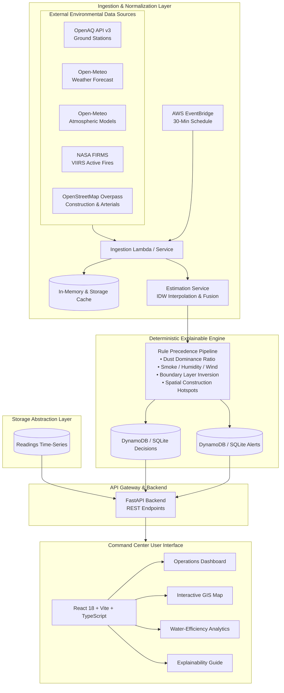

# ClearSky Intelligence — System Architecture

**Product Name:** ClearSky Intelligence  
**Descriptor:** Smart Urban Air Intelligence  
**Team:** Quantified Minds (Ishaan Chaturvedi, Ankit Kumar Tiwari)  

---

## 1. Executive Architectural Overview

ClearSky Intelligence is designed as an explainable, cloud-native environmental decision support platform. It integrates ground-station air-quality observations, numerical atmospheric forecasts, satellite thermal anomalies, and urban infrastructure geometries to provide municipal authorities with evidence-based dust mitigation recommendations.

---

## 2. Component Design

### 2.1 Storage Abstraction (`app/repositories`)
The platform decouples data persistence from application logic through the `BaseRepository` interface:
- **Local Development:** `SQLiteRepository` (`data/clearsky.db`) provides full relational querying, time-series indexes, and automatic seeding without requiring AWS credentials or cloud services.
- **AWS Production:** `DynamoDBRepository` maps partition keys around `zone_id` and sort keys around UTC ISO timestamps (`timestamp`, `scored_at`), enabling scalable high-frequency ingestion and historical replays.

### 2.2 Telemetry Ingestion & Estimation (`app/services/estimation_service.py`)
- **Spatial Proximity:** Evaluates nearby CPCB/DPCC ground stations using the Haversine formula (up to 25 km).
- **Inverse Distance Weighting (IDW):** For zones with multiple nearby monitoring stations, computes power-2 inverse distance weighted estimates for PM2.5 and PM10.
- **Atmospheric Model Fallback:** In the absence of direct ground station observations, gracefully ingests numerical atmospheric predictions (CAMS/Open-Meteo) and explicitly tags values as `modeled`.

### 2.3 Transparent Decision Engine (`app/services/decision_engine.py`)
Recommendations are deterministic and explainable:
1. **Rule Precedence:** Missing or stale data produces `ADVISORY_ONLY`. Active smoke plumes, humidity $\ge 80\%$, or ambient wind speed $\ge 20\text{ km/h}$ result in `INTERVENTION_NOT_RECOMMENDED`. High PM2.5 alone never triggers spraying.
2. **Dust Dominance Hypothesis:** Requires valid PM10 $\ge 120\ \mu\text{g/m}^3$ and $\text{PM10}/\text{PM2.5} \ge 2.0$.
3. **Priority Index (1–5):** Escalates based on severe PM10 ($\ge 250\ \mu\text{g/m}^3$), extreme ratio ($\ge 2.5$), and tagged construction site proximity ($\le 300\text{ m}$).

### 2.4 Water-Efficiency Backtesting Engine (`app/analytics/water_efficiency.py`)
Calculates avoidable water waste against a configurable fixed-schedule baseline:
$$\text{Baseline Interventions} = N_{\text{zones}} \times \text{RunsPerDay} \times \text{Days}$$
$$\text{Water Saved (Liters)} = \max(0, \text{Baseline Water} - \text{Recommended Water})$$
Outputs structured daily audit records with one-click CSV export.

---

## 3. Security & Operational Reliability
- **Least-Privilege IAM:** Dedicated execution roles for Lambdas restricted to specific DynamoDB tables.
- **API Guarding:** `/api/admin/refresh` protected by API keys in production.
- **Defensive Error Handling:** Timeout budgets, bounded retries, and TTL caching prevent external API rate-limiting or cascade failures.
